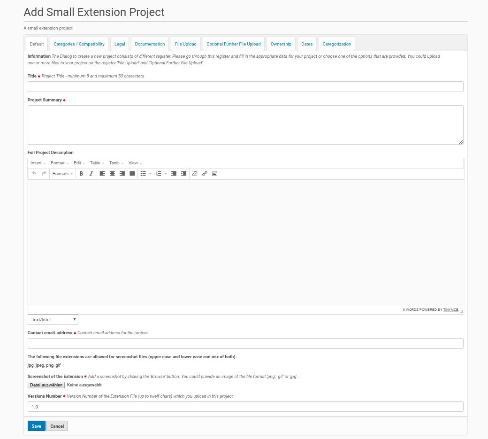
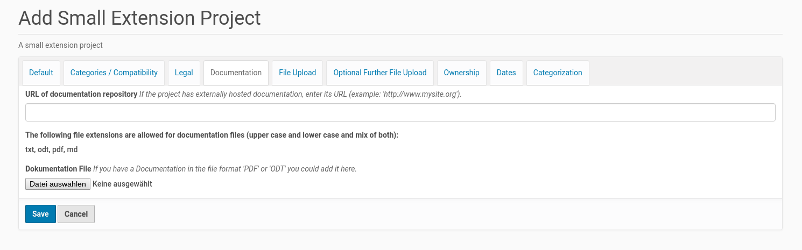

Add A New Small Extension Project To The Extension Center
#########################################################

A small extension project is an easy and fast way to publish very small
extension project inside the 'Extensions Center'. This sort of project
should only be used, if there is not the need to publish releases and
upload files for a lot of different platforms (operating systems).

Because it was created for small projects, a small extension project
could be created within a few minutes. Therefor a member of the Plone
site (logged-in user) click inside the 'Extension Center' with the mouse
first on the link in the box on the right side (see screenshot below).

.. image:: images/create_extension_small_project.png
   :width: 750

This mouse click opens the form for providing a new Small Extensions Project.
The form dialog consists of several register. The form fields in the first
register asks for more general information about the project. It's possible
to edit and change the content of the fields later, if the focus or
the features of the project varies.

The First Register 'Default'
****************************

The new extension project needs its own title with a length from 5 to 50
characters. This title has to be unique inside the 'Extension Center'. If
there is already another small extension project or an extension project
with the same title the member will get an error message with the
appropriate information. Thus he had to choose another title for his
small extension project.

A new project needs also a summary and could get a full description of its
purpose and features. The latter one is optional (only form fields with a
red point behind the title are mandatory).

It's also necessary that the member provides an email-address. This address
will be used to get in contact with the project (owner). The 'Extension
Center' sends e.g. messages if the status of the project changes (e.g. it
was published by a reviewer). Users of the project / extension could
send feedback to the author within a form. The content of this form will
be send by email to the project (owner) (The feedback provider will not see
the email address of the project).

The small extension project need also a screenshot. It will be shown on the
project page and helps the website user to get a first impression of the
usecase of the extension. The allowed file extensions are displayed next to
the button to call the file dialog. The Plone site administrator choose
this allowed file extensions within the 'Extension Center'.

The last field on this first register ('Version Number') gives the
opportunity to set the version of the extension file(s). The field has a
default value of '1.0' but it is recommend to change this number according
to the state of the extension. If the extension is not in a stable state,
the field should set to a numbering lower than 1.0. If the project owner
uploads a new version of the extension (extension file(s)) she / he should
change the value of this field.

The Second Register 'Categories / Compatibility'
************************************************

The small extension projects were assigned to one or more categories.
The creator of the extension project could choose on this register one or
more categories, the new small extension project matches.

There is also a list of LibreOffice versions on this register. The project
owner had to choose at least one of them the extension is compatible with.

The list of categories and LibreOffice versions on this register had
been created by the Plone site administrator within the 'Extension Center'.

.. image:: images/extension_small_project_form02.png
   :width: 750

The Third Register 'Legal'
**************************

The third register shows the necessary fields for the legal statements about
the extension and the small extension project. It starts with the license
for the extension. It is possible to check more than one license for an
extension. This declaration need to be in accordance with the license
declaration inside the extension file (if there is one inside).

.. image:: images/extension_small_project_form03.png
   :width: 750

There is also a read-only form field which contains the text of the legal
disclaimer that has to be accepted by the small extension project owner.
The text of the legal disclaimer will be set by the site admin inside the
'Extension Center'.

If the source code is not inside the extension file (the drop down field
is set to 'No'), it is necessary to fill in the link to the source code in
the form field at the bottom of the register. If such a link will not be
submitted the project owner gets an error message.

The Fourth Register 'Documentation'
***********************************

This  register provide the opportunity to upload a documentation file.
It will be linked from the project ressources in the project view. The
allowed file extensions are displayed next to the button to call the file
dialog.The Plone site administrator choose this allowed file extensions
within the 'Extension Center'.

The Fifth Register 'File Upload'
********************************

This register is the place to upload the extension file and declare
which platform it is compatible with.

.. image:: images/extension_small_project_form05.png
   :width: 750

If there are versions of the extension file for different platforms
(e.g. one for MS Windows and another one for Linux only) this further
extension files could be uploaded using the following register.

The list of platforms in the listing below the the upload field will be
created by the site admin inside the 'Extension Center'. She / he is able
to expand this list at any time if desired.